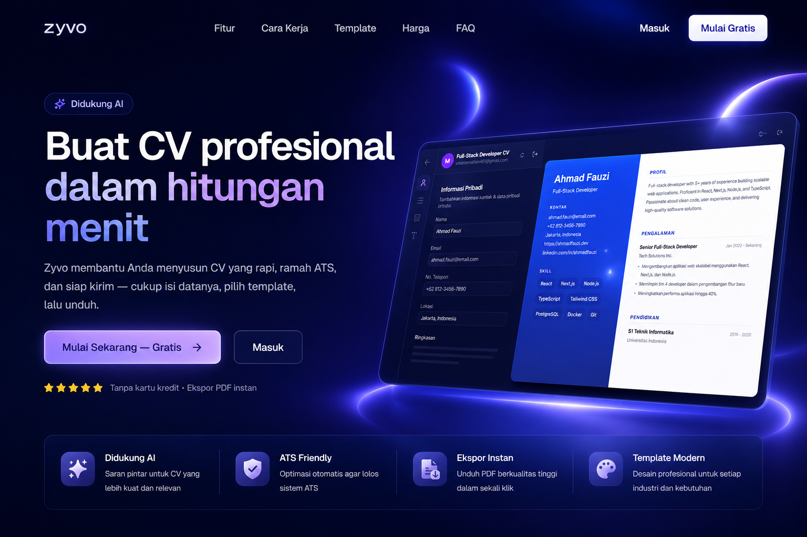

<div align="center">
  
</div>

<h1 align="center">Zyvo</h1>

<p align="center">
  <strong>AI-assisted CV/resume builder for the Indonesian job market.</strong><br />
  Craft, edit, and export professional, ATS-friendly CVs — with a live-preview editor, AI writing help, and print-quality PDF/PNG export.
</p>

<p align="center">
  <a href="#features">Features</a> ·
  <a href="#tech-stack">Tech Stack</a> ·
  <a href="#getting-started">Getting Started</a> ·
  <a href="#project-structure">Project Structure</a> ·
  <a href="#conventions">Conventions</a>
</p>

---

## Features

- **AI writing assistant** — formalize, shorten, or polish experience bullets in one click, plus translation to English. Also powers cover letters, job-posting analysis, scoring, and interview prep.
- **9 designer templates** — `minimal`, `professional`, `classic`, `modern`, `fresh-graduate`, `elegant`, `executive`, `compact`, and `creative`, all rendered from live CV content.
- **ATS-friendly** — clean, single-source markup with no layout tricks that break automated application-tracker parsers.
- **Full design control** — custom color presets, heading fonts, font sizes, and line-height sliders, all applied live in the editor.
- **Autosave** — every change persists automatically via an 800ms debounced save; close the tab and pick up where you left off.
- **Export** — print-quality PDF via Puppeteer, plus PNG for sharing online.
- **Job tracker** — track applications from a dedicated dashboard.
- **Billing** — Midtrans-powered subscriptions with sandbox/production keys.
- **Authentication** — Better Auth with email/password and Google OAuth.

## Tech Stack

| Layer | Technology |
|-------|-----------|
| Framework | **Next.js 16** (App Router, Turbopack), **React 19.2** with React Compiler |
| Styling | **Tailwind CSS v4** + **shadcn/ui** |
| API | **tRPC v11** — end-to-end typesafe API |
| Auth | **Better Auth** |
| Database | **MongoDB** via **Prisma** (CV sections as embedded composite types) |
| State | **Zustand** — CV builder state with debounced autosave |
| Validation | **Zod** — single source of truth for tRPC input and react-hook-form |
| AI | **OpenAI / OpenRouter** |
| Payments | **Midtrans** |
| Export | **Puppeteer-core + @sparticuz/chromium** |
| Analytics | **PostHog** |
| Caching | **Upstash Redis** |
| Lint / Format | **Biome v2** |

## Getting Started

### Prerequisites

- [Bun](https://bun.sh) 1.x
- A [MongoDB](https://www.mongodb.com/) connection string

### Install

```bash
bun install
```

`postinstall` auto-runs `prisma generate`.

### Environment

Copy the template and fill in your values:

```bash
cp .env.example .env
```

The minimum required variables:

```bash
DATABASE_URL="mongodb+srv://..."
BETTER_AUTH_SECRET="openssl rand -base64 32"
BETTER_AUTH_URL="http://localhost:3000"
```

### Run

```bash
bun db:push    # push the Prisma schema to MongoDB
bun dev        # start the dev server on http://localhost:3000
```

### Environment Variables

| Variable | Required | Description |
|----------|----------|-------------|
| `DATABASE_URL` | ✅ | MongoDB connection string |
| `BETTER_AUTH_SECRET` | ✅ | Better Auth secret (`openssl rand -base64 32`) |
| `BETTER_AUTH_URL` | ✅ | Auth base URL, e.g. `http://localhost:3000` |
| `GOOGLE_CLIENT_ID` / `GOOGLE_CLIENT_SECRET` | ⬜ | Google OAuth provider |
| `UPLOADTHING_SECRET` / `UPLOADTHING_TOKEN` | ⬜ | File uploads (resume attachments) |
| `NEXT_PUBLIC_POSTHOG_KEY` / `NEXT_PUBLIC_POSTHOG_HOST` | ⬜ | PostHog analytics |
| `MIDTRANS_SANDBOX_*` / `MIDTRANS_PRODUCTION_*` | ⬜ | Midtrans payment keys |
| `OPENROUTER_API_KEY` | ⬜ | AI features (models default to `openai/gpt-4o` and `openai/gpt-4o-mini`) |
| `NEXT_PUBLIC_APP_URL` | ⬜ | Public site URL, used for SEO and billing redirects |

## Scripts

| Command | Action |
|---------|--------|
| `bun dev` | Start the dev server (port 3000) |
| `bun build` | Production build |
| `bun start` | Start the production server |
| `bun lint` | Biome check |
| `bun format` | Biome format --write |
| `bun db:push` | Push Prisma schema to MongoDB |
| `bun db:generate` | Regenerate Prisma Client |
| `bun db:studio` | Open Prisma Studio |

## Project Structure

```
app/
  (auth)/                    # protected pages (server-side session check)
    builder/                 # CV dashboard
      [cvId]/                # CV editor
      [cvId]/print/          # print-ready CV view
  (dashboard)/               # dashboard pages (onboarding, settings, billing, AI)
  api/auth/[...all]/         # Better Auth handler
  api/trpc/[trpc]/           # tRPC fetch handler
features/
  cv/                        # CV builder — store, schemas, autosave, tRPC router, templates
  ai/                        # AI router (OpenAI/OpenRouter) + client
  auth/                      # Better Auth config + route guards
  job-tracker/               # job application tracking
  billing/                   # Midtrans subscriptions
  marketing/                 # landing page, pricing, FAQ
server/trpc/                 # tRPC core (trpc.ts, context.ts, server.ts) + root router
proxy.ts                     # Next.js 16 proxy (optimistic auth check via session cookie)
```

Each feature owns its `components/`, `hooks/`, `schemas/`, `stores/`, `server/`, and `lib/`. The `@/*` path alias maps to the project root.

## Conventions

- **All DB access goes through the tRPC backend** — no direct client-to-MongoDB calls.
- **CV ownership** is enforced via a `userId` string matching the Better Auth user ID (no formal Prisma relation, to avoid coupling).
- **Validation** uses Zod on both the tRPC input (server) and the react-hook-form resolver (client), with `features/cv/schemas/cv.ts` as the single source of truth.
- **Styling** uses Tailwind CSS v4 (`@import "tailwindcss"` + `@theme`), not the v3 config.
- **shadcn/ui** components live in `components/ui/`; feature code lives under `features/<feature>/`.

## License

Private repository. All rights reserved.
